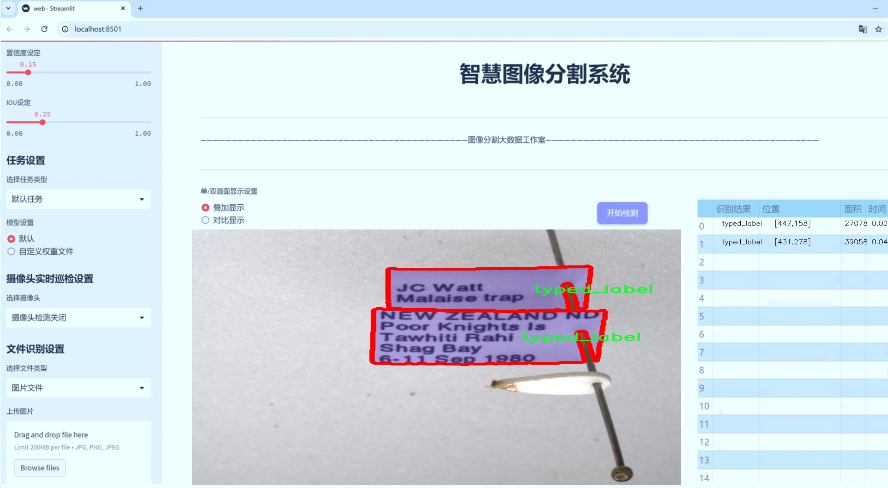
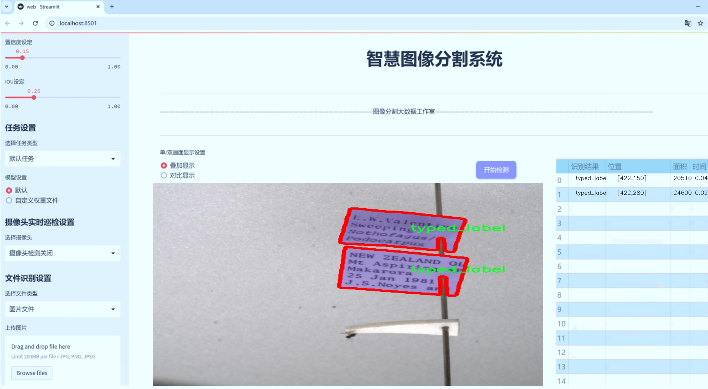
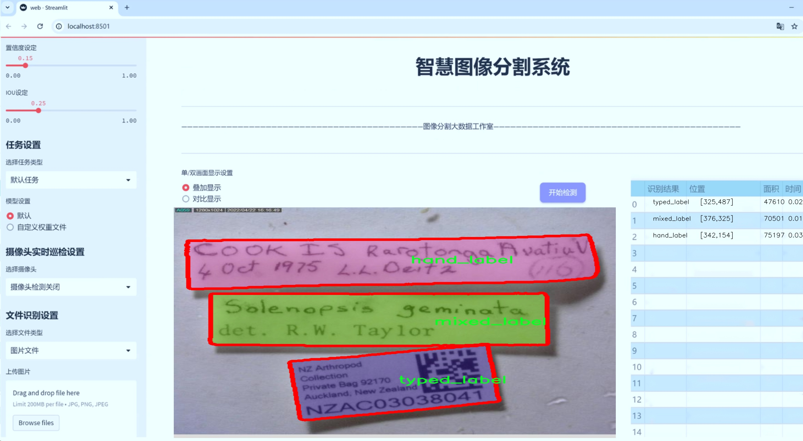
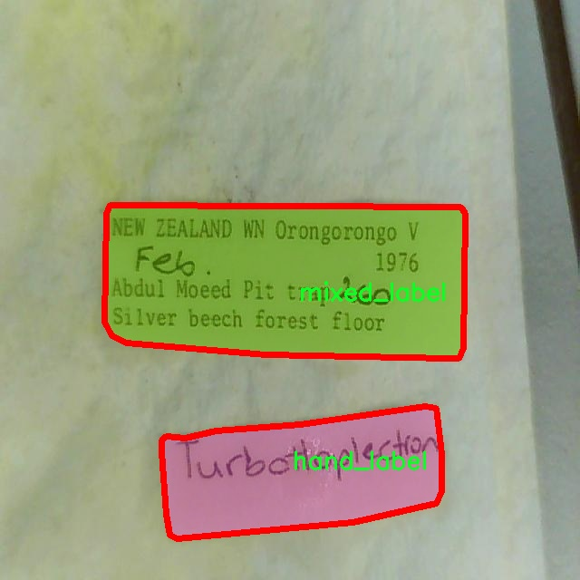
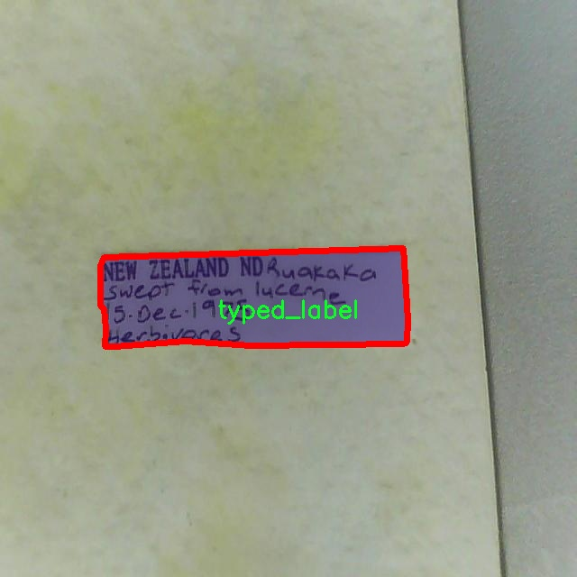
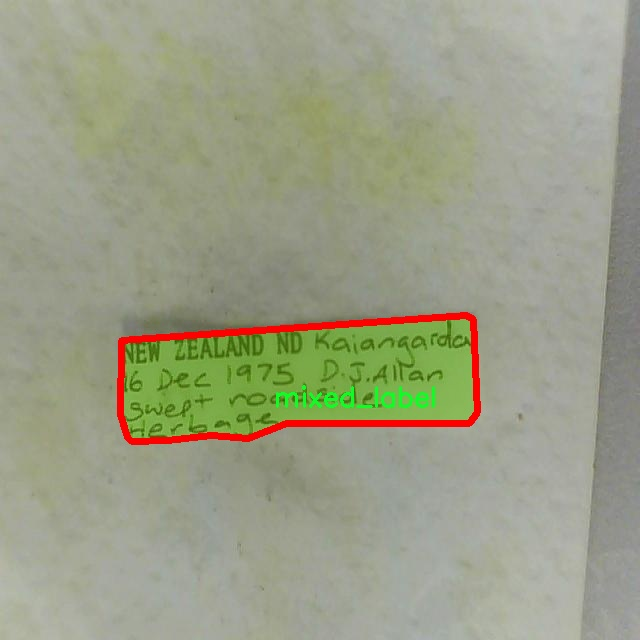
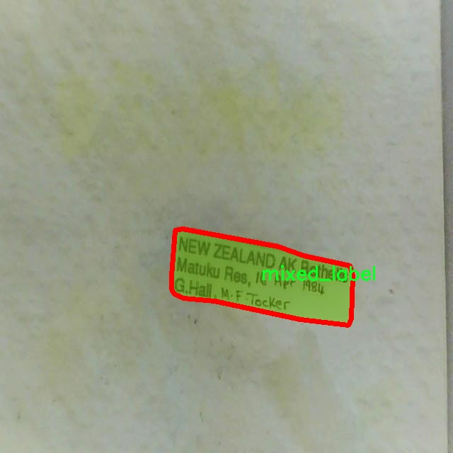
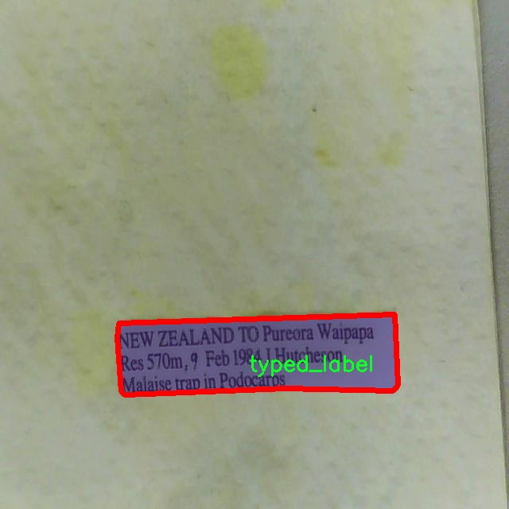

# 标签类型识别图像分割系统源码＆数据集分享
 [yolov8-seg-fasternet-bifpn＆yolov8-seg-KernelWarehouse等50+全套改进创新点发刊_一键训练教程_Web前端展示]

### 1.研究背景与意义

项目参考[ILSVRC ImageNet Large Scale Visual Recognition Challenge](https://gitee.com/YOLOv8_YOLOv11_Segmentation_Studio/projects)

项目来源[AAAI Global Al lnnovation Contest](https://kdocs.cn/l/cszuIiCKVNis)

研究背景与意义

随着计算机视觉技术的迅猛发展，图像分割作为其中的重要研究方向，已经在多个领域展现出其广泛的应用潜力，包括自动驾驶、医学影像分析、视频监控以及智能制造等。图像分割的核心任务是将图像中的不同对象或区域进行有效的分离和标识，以便于后续的分析和处理。近年来，深度学习特别是卷积神经网络（CNN）的引入，极大地推动了图像分割技术的进步。YOLO（You Only Look Once）系列模型作为目标检测领域的佼佼者，凭借其高效的实时性和准确性，逐渐被应用于图像分割任务中。

本研究旨在基于改进的YOLOv8模型，构建一个针对标签类型识别的图像分割系统。该系统将利用一个包含2400张图像的数据集，该数据集涵盖了三种类别的标签：手动标签（hand_label）、混合标签（mixed_label）和类型标签（typed_label）。通过对这些标签的有效识别与分割，系统不仅能够提高图像处理的精度，还能为相关领域提供更为精细化的分析工具。

在当前的图像分割研究中，标签类型的准确识别是一个关键挑战。传统的图像分割方法往往依赖于手工特征提取，无法充分利用图像的深层特征信息。而YOLOv8模型通过引入更深层次的网络结构和改进的特征提取机制，能够更好地捕捉图像中的细节信息，进而提高分割的准确性。此外，YOLOv8在处理复杂场景时的鲁棒性和实时性，使其成为处理多类别标签识别的理想选择。

本研究的意义不仅在于提升图像分割的技术水平，更在于推动标签类型识别的应用落地。通过对手动标签、混合标签和类型标签的精确分割，相关行业可以实现更高效的自动化处理。例如，在智能制造领域，准确的标签识别可以帮助机器人更好地进行物体抓取和分类；在医学影像分析中，精确的分割结果能够辅助医生进行更为准确的诊断和治疗方案制定。

此外，本研究还将为未来的研究提供重要的参考和借鉴。通过对YOLOv8模型的改进和优化，研究者可以探索更多适用于不同场景的图像分割方法，推动计算机视觉技术的进一步发展。同时，数据集的构建和应用也为后续的研究提供了丰富的基础数据，促进了学术界与工业界的合作与交流。

综上所述，基于改进YOLOv8的标签类型识别图像分割系统的研究，不仅具有重要的理论价值，还有着广泛的实际应用前景。通过深入探索这一领域，研究者能够为推动图像分割技术的发展贡献新的思路和方法，进而为相关行业的智能化转型提供强有力的技术支持。

### 2.图片演示







##### 注意：由于此博客编辑较早，上面“2.图片演示”和“3.视频演示”展示的系统图片或者视频可能为老版本，新版本在老版本的基础上升级如下：（实际效果以升级的新版本为准）

  （1）适配了YOLOV8的“目标检测”模型和“实例分割”模型，通过加载相应的权重（.pt）文件即可自适应加载模型。

  （2）支持“图片识别”、“视频识别”、“摄像头实时识别”三种识别模式。

  （3）支持“图片识别”、“视频识别”、“摄像头实时识别”三种识别结果保存导出，解决手动导出（容易卡顿出现爆内存）存在的问题，识别完自动保存结果并导出到tempDir中。

  （4）支持Web前端系统中的标题、背景图等自定义修改，后面提供修改教程。

  另外本项目提供训练的数据集和训练教程,暂不提供权重文件（best.pt）,需要您按照教程进行训练后实现图片演示和Web前端界面演示的效果。

### 3.视频演示

[3.1 视频演示](https://www.bilibili.com/video/BV1JWmMYjEWi/)

### 4.数据集信息展示

##### 4.1 本项目数据集详细数据（类别数＆类别名）

nc: 3
names: ['hand_label', 'mixed_label', 'typed_label']


##### 4.2 本项目数据集信息介绍

数据集信息展示

在本研究中，我们采用了名为“my instance”的数据集，以支持对YOLOv8-seg模型的训练和优化，旨在改进标签类型识别的图像分割系统。该数据集包含三种主要类别，分别为“hand_label”、“mixed_label”和“typed_label”，这些类别的选择反映了在实际应用中标签识别的多样性和复杂性。

“my instance”数据集的设计充分考虑了图像分割任务的需求。首先，数据集中包含的“hand_label”类别主要指代手工标注的标签，这类标签通常由人工进行精细化处理，具有较高的准确性和可读性。通过对这一类别的训练，模型能够学习到手工标注的特征，从而在实际应用中提高对手工标签的识别能力。这对于需要高精度标签识别的场景尤为重要，例如在医疗影像分析或文档处理等领域。

其次，“mixed_label”类别则代表了混合类型的标签，这些标签可能包含手工标注和自动生成的元素。这一类别的引入使得模型能够适应更为复杂的场景，学习如何在不同来源的标签中进行有效区分。混合标签的存在不仅增加了数据集的多样性，也为模型的鲁棒性提供了挑战。通过对这一类别的训练，模型将能够更好地处理实际应用中常见的标签混合情况，从而提升其在多变环境下的表现。

最后，“typed_label”类别则专注于特定类型的标签，这些标签通常具有明确的格式和结构，可能来源于标准化的文档或系统生成的内容。对这一类别的训练使得模型能够识别和解析结构化标签的特征，从而在信息提取和自动化处理方面展现出更高的效率和准确性。这一类别的引入对于实现智能化标签处理和信息管理具有重要意义。

整体而言，“my instance”数据集的构建不仅考虑了标签类型的多样性，还注重了不同标签之间的相互关系和特征差异。通过对这三种类别的综合训练，YOLOv8-seg模型将能够在图像分割任务中实现更高的精度和更强的适应性。数据集中的每一类标签都为模型提供了独特的学习视角，使其能够在面对真实世界中的复杂场景时，依然保持良好的性能。

此外，为了确保数据集的有效性和代表性，数据集中的图像样本经过精心挑选，涵盖了多种场景和条件。这种多样性不仅增强了模型的泛化能力，也为后续的研究和应用提供了坚实的基础。通过对“my instance”数据集的深入分析和应用，我们期望能够推动图像分割技术的发展，为标签类型识别领域带来新的突破和进展。











### 5.全套项目环境部署视频教程（零基础手把手教学）

[5.1 环境部署教程链接（零基础手把手教学）](https://www.bilibili.com/video/BV1jG4Ve4E9t/?vd_source=bc9aec86d164b67a7004b996143742dc)


[5.2 安装Python虚拟环境创建和依赖库安装视频教程链接（零基础手把手教学）](https://www.bilibili.com/video/BV1nA4VeYEze/?vd_source=bc9aec86d164b67a7004b996143742dc)

### 6.手把手YOLOV8-seg训练视频教程（零基础小白有手就能学会）

[6.1 手把手YOLOV8-seg训练视频教程（零基础小白有手就能学会）](https://www.bilibili.com/video/BV1cA4VeYETe/?vd_source=bc9aec86d164b67a7004b996143742dc)


按照上面的训练视频教程链接加载项目提供的数据集，运行train.py即可开始训练



     Epoch   gpu_mem       box       obj       cls    labels  img_size
     1/200     0G   0.01576   0.01955  0.007536        22      1280: 100%|██████████| 849/849 [14:42<00:00,  1.04s/it]
               Class     Images     Labels          P          R     mAP@.5 mAP@.5:.95: 100%|██████████| 213/213 [01:14<00:00,  2.87it/s]
                 all       3395      17314      0.994      0.957      0.0957      0.0843

     Epoch   gpu_mem       box       obj       cls    labels  img_size
     2/200     0G   0.01578   0.01923  0.007006        22      1280: 100%|██████████| 849/849 [14:44<00:00,  1.04s/it]
               Class     Images     Labels          P          R     mAP@.5 mAP@.5:.95: 100%|██████████| 213/213 [01:12<00:00,  2.95it/s]
                 all       3395      17314      0.996      0.956      0.0957      0.0845

     Epoch   gpu_mem       box       obj       cls    labels  img_size
     3/200     0G   0.01561    0.0191  0.006895        27      1280: 100%|██████████| 849/849 [10:56<00:00,  1.29it/s]
               Class     Images     Labels          P          R     mAP@.5 mAP@.5:.95: 100%|███████   | 187/213 [00:52<00:00,  4.04it/s]
                 all       3395      17314      0.996      0.957      0.0957      0.0845


### 7.50+种全套YOLOV8-seg创新点代码加载调参视频教程（一键加载写好的改进模型的配置文件）

[7.1 50+种全套YOLOV8-seg创新点代码加载调参视频教程（一键加载写好的改进模型的配置文件）](https://www.bilibili.com/video/BV1Hw4VePEXv/?vd_source=bc9aec86d164b67a7004b996143742dc)

### 8.YOLOV8-seg图像分割算法原理

原始YOLOv8-seg算法原理

YOLOv8-seg算法是基于YOLOv8模型的一个重要扩展，旨在实现目标检测与实例分割的结合。自2023年1月Ultralytics团队推出YOLOv8以来，该模型便以其卓越的性能和灵活性在计算机视觉领域中引起了广泛关注。YOLOv8-seg在YOLOv8的基础上，进一步增强了对图像中目标的分割能力，使其不仅能够识别目标的位置，还能精确地划分出目标的形状。

YOLOv8-seg的核心思想在于结合了目标检测与分割的任务，通过高效的网络结构和创新的损失函数设计，实现了在复杂场景下的高精度分割。首先，YOLOv8-seg在特征提取阶段采用了CSPDarknet作为主干网络，CSPDarknet通过引入跨阶段局部网络（CSP）设计，能够有效地提取图像中的多层次特征。这一结构的优势在于它能够在保持较少参数量的同时，增强模型的特征表达能力，从而提高目标检测和分割的准确性。

在YOLOv8-seg中，C2f模块的引入是一个显著的改进。C2f模块不仅保留了C3模块的优点，还通过增加跳层连接和分支操作，进一步丰富了特征图的信息流。这种设计使得模型在处理复杂的图像时，能够更好地捕捉到目标的细节特征，从而提高分割的精度。此外，YOLOv8-seg还在颈部网络中进行了优化，采用了更高效的特征融合策略，以便更好地整合来自不同尺度的特征信息，增强模型对小目标和高分辨率图像的处理能力。

在检测头的设计上，YOLOv8-seg采用了无锚框（Anchor-Free）的方法，直接预测目标的中心点和宽高比。这一创新不仅简化了模型的结构，还提高了检测速度和准确度。与传统的锚框方法相比，无锚框设计减少了模型对先验框的依赖，使得模型在面对不同形状和大小的目标时，能够更灵活地进行适应。此外，YOLOv8-seg还引入了任务对齐学习（Task Alignment Learning，TAL）机制，通过引入分类分数和IOU的高次幂乘积，优化了目标定位和分类的损失函数，使得模型在训练过程中能够更好地平衡定位和分类的精度。

在损失函数的设计上，YOLOv8-seg结合了目标检测和实例分割的需求，提出了一种新的损失计算方式。这种损失函数不仅考虑了目标的类别和位置，还对分割结果的精度进行了评估。通过这种方式，YOLOv8-seg能够在训练过程中不断优化分割的边界，使得最终的分割结果更加精确。

YOLOv8-seg在实际应用中展现出了优越的性能，尤其是在复杂背景下的目标分割任务中。通过在COCO数据集上的测试，YOLOv8-seg不仅在检测精度上超越了许多现有的目标检测与分割模型，同时在推理速度上也表现出色。这使得YOLOv8-seg成为实时目标检测与分割任务的理想选择，尤其适用于机器人视觉、自动驾驶等需要高实时性和高准确性的场景。

综上所述，YOLOv8-seg算法通过对YOLOv8模型的结构优化和功能扩展，成功实现了目标检测与实例分割的有效结合。其创新的网络设计、无锚框检测方法以及优化的损失函数，使得YOLOv8-seg在多种应用场景中都能展现出卓越的性能。随着计算机视觉技术的不断发展，YOLOv8-seg无疑将在未来的研究和应用中发挥重要作用。


### 9.系统功能展示（检测对象为举例，实际内容以本项目数据集为准）

图9.1.系统支持检测结果表格显示

  图9.2.系统支持置信度和IOU阈值手动调节

  图9.3.系统支持自定义加载权重文件best.pt(需要你通过步骤5中训练获得)

  图9.4.系统支持摄像头实时识别

  图9.5.系统支持图片识别

  图9.6.系统支持视频识别

  图9.7.系统支持识别结果文件自动保存

  图9.8.系统支持Excel导出检测结果数据


### 10.50+种全套YOLOV8-seg创新点原理讲解（非科班也可以轻松写刊发刊，V11版本正在科研待更新）

#### 10.1 由于篇幅限制，每个创新点的具体原理讲解就不一一展开，具体见下列网址中的创新点对应子项目的技术原理博客网址【Blog】：


[10.1 50+种全套YOLOV8-seg创新点原理讲解链接](https://gitee.com/qunmasj/good)

#### 10.2 部分改进模块原理讲解(完整的改进原理见上图和技术博客链接)【如果此小节的图加载失败可以通过CSDN或者Github搜索该博客的标题访问原始博客，原始博客图片显示正常】

### YOLOv8简介


由上图可以看出，C2中每个BottlNeck的输入Tensor的通道数channel都只是上一级的0.5倍，因此计算量明显降低。从另一方面讲，梯度流的增加，t也能够明显提升收敛速度和收敛效果。
C2i模块首先以输入tensor(n.c.h.w)经过Conv1层进行split拆分，分成两部分(n,0.5c,h,w)，一部分直接经过n个Bottlenck，另一部分经过每一操作层后都会以(n.0.5c,h,w)的尺寸进行Shortcut，最后通过Conv2层卷积输出。也就是对应n+2的Shortcut(第一层Conv1的分支tensor和split后的tensor为2+n个bottenlenneck)。
#### Neck
YOLOv8的Neck采用了PANet结构，如下图所示。

Backbone最后SPPF模块(Layer9)之后H、W经过32倍下采样，对应地Layer4经过8倍下采样，Layer6经过16倍下采样。输入图片分辨率为640*640，得到Layer4、Layer6、Layer9的分辨率分别为80*80、40*40和20*20。
Layer4、Layer6、Layer9作为PANet结构的输入，经过上采样，通道融合，最终将PANet的三个输出分支送入到Detect head中进行Loss的计算或结果解算。
与FPN(单向，自上而下)不同的是，PANet是一个双向通路网络，引入了自下向上的路径，使得底层信息更容易传递到顶层。
#### Head
Head部分相比Yolov5改动较大，直接将耦合头改为类似Yolo的解耦头结构(Decoupled-Head)，将回归分支和预测分支分离，并针对回归分支使用了Distribution Focal Loss策略中提出的积分形式表示法。之前的目标检测网络将回归坐标作为一个确定性单值进行预测，DFL将坐标转变成一个分布。


### LSKNet的架构
该博客提出的结构层级依次为：

LSK module（大核卷积序列+空间选择机制） < LSK Block （LK Selection + FFN）<LSKNet（N个LSK Block）


#### LSK 模块

LSK Block
LSKNet 是主干网络中的一个可重复堆叠的块（Block），每个LSK Block包括两个残差子块，即大核选择子块（Large Kernel Selection，LK Selection）和前馈网络子块（Feed-forward Network ，FFN），如图8。LK Selection子块根据需要动态地调整网络的感受野，FFN子块用于通道混合和特征细化，由一个全连接层、一个深度卷积、一个 GELU 激活和第二个全连接层组成。

LSK module（LSK 模块，图4）由一个大核卷积序列（large kernel convolutions）和一个空间核选择机制（spatial kernel selection mechanism）组成，被嵌入到了LSK Block 的 LK Selection子块中。

#### Large Kernel Convolutions
因为不同类型的目标对背景信息的需求不同，这就需要模型能够自适应选择不同大小的背景范围。因此，作者通过解耦出一系列具有大卷积核、且不断扩张的Depth-wise 卷积，构建了一个更大感受野的网络。

具体地，假设序列中第i个Depth-wise 卷积核的大小为 ，扩张率为 d，感受野为 ，它们满足以下关系：


卷积核大小和扩张率的增加保证了感受野能够快速增大。此外，我们设置了扩张率的上限，以保证扩张卷积不会引入特征图之间的差距。


Table2的卷积核大小可根据公式（1）和（2）计算，详见下图：


这样设计的好处有两点。首先，能够产生具有多种不同大小感受野的特征，便于后续的核选择；第二，序列解耦比简单的使用一个大型卷积核效果更好。如上图表2所示，解耦操作相对于标准的大型卷积核，有效地将低了模型的参数量。

为了从输入数据  的不同区域获取丰富的背景信息特征，可采用一系列解耦的、不用感受野的Depth-wise 卷积核：


其中，是卷积核为 、扩张率为  的Depth-wise 卷积操作。假设有个解耦的卷积核，每个卷积操作后又要经过一个的卷积层进行空间特征向量的通道融合。


之后，针对不同的目标，可基于获取的多尺度特征，通过下文中的选择机制动态选择合适的卷积核大小。

这一段的意思可以简单理解为：

把一个大的卷积核拆成了几个小的卷积核，比如一个大小为5，扩张率为1的卷积核加上一个大小为7，扩张率为3的卷积核，感受野为23，与一个大小为23，扩张率为1的卷积核的感受野是一样的。因此可用两个小的卷积核替代一个大的卷积核，同理一个大小为29的卷积核也可以用三个小的卷积代替（Table 2），这样可以有效的减少参数，且更灵活。

将输入数据依次通过这些小的卷积核（公式3），并在每个小的卷积核后面接上一个1×1的卷积进行通道融合（公式4）。

#### Spatial Kernel Selection
为了使模型更关注目标在空间上的重点背景信息，作者使用空间选择机制从不同尺度的大卷积核中对特征图进行空间选择。

首先，将来自于不同感受野卷积核的特征进行concate拼接，然后，应用通道级的平均池化和最大池化提取空间关系，其中， 和  是平均池化和最大池化后的空间特征描述符。为了实现不同空间描述符的信息交互，作者利用卷积层将空间池化特征进行拼接，将2个通道的池化特征转换为N个空间注意力特征图，之后，将Sigmoid激活函数应用到每一个空间注意力特征图，可获得每个解耦的大卷积核所对应的独立的空间选择掩膜，又然后，将解耦后的大卷积核序列的特征与对应的空间选择掩膜进行加权处理，并通过卷积层进行融合获得注意力特征 ，最后LSK module的输出可通过输入特征  与注意力特征  的逐元素点成获得，公式对应于结构图上的操作如下：


### 11.项目核心源码讲解（再也不用担心看不懂代码逻辑）

#### 11.1 ui.py

以下是对给定代码的核心部分进行提炼和详细注释的版本：

```python
import sys
import subprocess

def run_script(script_path):
    """
    使用当前 Python 环境运行指定的脚本。

    Args:
        script_path (str): 要运行的脚本路径

    Returns:
        None
    """
    # 获取当前 Python 解释器的路径
    python_path = sys.executable

    # 构建运行命令，使用 streamlit 运行指定的脚本
    command = f'"{python_path}" -m streamlit run "{script_path}"'

    # 执行命令
    result = subprocess.run(command, shell=True)
    
    # 检查命令执行结果，如果返回码不为0，表示出错
    if result.returncode != 0:
        print("脚本运行出错。")

# 主程序入口
if __name__ == "__main__":
    # 指定要运行的脚本路径
    script_path = "web.py"  # 这里可以直接指定脚本名称

    # 调用函数运行脚本
    run_script(script_path)
```

### 代码注释说明：

1. **导入模块**：
   - `sys`：用于获取当前 Python 解释器的路径。
   - `subprocess`：用于执行外部命令。

2. **`run_script` 函数**：
   - 该函数接受一个参数 `script_path`，表示要运行的 Python 脚本的路径。
   - 使用 `sys.executable` 获取当前 Python 解释器的路径，以确保使用正确的 Python 环境来运行脚本。
   - 构建命令字符串，使用 `streamlit` 模块运行指定的脚本。
   - 使用 `subprocess.run` 执行构建的命令，并通过 `shell=True` 允许在 shell 中执行。
   - 检查命令的返回码，如果返回码不为0，表示脚本运行出错，打印错误信息。

3. **主程序入口**：
   - 通过 `if __name__ == "__main__":` 确保该代码块仅在直接运行脚本时执行。
   - 指定要运行的脚本路径为 `web.py`。
   - 调用 `run_script` 函数来执行指定的脚本。 

此代码的核心功能是通过当前 Python 环境运行一个指定的脚本，并处理可能的错误。

这个文件是一个名为 `ui.py` 的 Python 脚本，主要功能是运行一个名为 `web.py` 的 Streamlit 应用。首先，脚本导入了必要的模块，包括 `sys`、`os` 和 `subprocess`，这些模块提供了与系统交互的功能。

在 `run_script` 函数中，接受一个参数 `script_path`，该参数是要运行的脚本的路径。函数的第一步是获取当前 Python 解释器的路径，这通过 `sys.executable` 实现。接着，构建一个命令字符串，使用当前的 Python 解释器和 Streamlit 模块来运行指定的脚本。命令的格式是 `"{python_path}" -m streamlit run "{script_path}"`，其中 `python_path` 是当前 Python 解释器的路径，`script_path` 是传入的脚本路径。

随后，使用 `subprocess.run` 函数执行这个命令，`shell=True` 参数允许在 shell 中执行命令。执行后，检查返回的结果，如果返回码不为 0，表示脚本运行出错，程序会打印出相应的错误信息。

在脚本的最后部分，使用 `if __name__ == "__main__":` 来确保只有在直接运行该脚本时才会执行以下代码。这里指定了要运行的脚本路径为 `web.py`，并调用 `run_script` 函数来执行这个脚本。

总的来说，这个脚本的主要作用是通过当前的 Python 环境启动一个 Streamlit 应用，方便用户在命令行中运行 Web 应用。

#### 11.2 ultralytics\nn\backbone\revcol.py

以下是代码中最核心的部分，并附上详细的中文注释：

```python
import torch
import torch.nn as nn

class ReverseFunction(torch.autograd.Function):
    @staticmethod
    def forward(ctx, run_functions, alpha, *args):
        # 获取运行的函数和缩放因子
        l0, l1, l2, l3 = run_functions
        alpha0, alpha1, alpha2, alpha3 = alpha
        
        # 保存上下文信息
        ctx.run_functions = run_functions
        ctx.alpha = alpha
        
        # 获取输入参数
        [x, c0, c1, c2, c3] = args
        
        # 计算每一层的输出
        with torch.no_grad():
            c0 = l0(x, c1) + c0 * alpha0
            c1 = l1(c0, c2) + c1 * alpha1
            c2 = l2(c1, c3) + c2 * alpha2
            c3 = l3(c2, None) + c3 * alpha3
        
        # 保存计算结果以便反向传播
        ctx.save_for_backward(x, c0, c1, c2, c3)
        return x, c0, c1, c2, c3

    @staticmethod
    def backward(ctx, *grad_outputs):
        # 获取保存的张量
        x, c0, c1, c2, c3 = ctx.saved_tensors
        l0, l1, l2, l3 = ctx.run_functions
        alpha0, alpha1, alpha2, alpha3 = ctx.alpha
        
        # 获取梯度
        gx_right, g0_right, g1_right, g2_right, g3_right = grad_outputs
        
        # 反向传播计算
        g3_up = g3_right
        g3_left = g3_up * alpha3  # shortcut
        oup3 = l3(c2, None)
        torch.autograd.backward(oup3, g3_up, retain_graph=True)
        
        # 计算特征反向
        c3_left = (1 / alpha3) * (c3 - oup3)
        g2_up = g2_right + c2.grad
        g2_left = g2_up * alpha2  # shortcut
        
        # 继续反向传播
        c2_left = (1 / alpha2) * (c2 - oup2)
        g1_up = g1_right + c1.grad
        g1_left = g1_up * alpha1  # shortcut
        
        # 反向传播至输入
        g0_up = g0_right + c0.grad
        g0_left = g0_up * alpha0  # shortcut
        
        # 返回梯度
        return None, None, gx_up, g0_left, g1_left, g2_left, g3_left

class SubNet(nn.Module):
    def __init__(self, channels, layers, kernel, first_col, save_memory) -> None:
        super().__init__()
        # 初始化子网络的参数
        self.alpha0 = nn.Parameter(torch.ones((1, channels[0], 1, 1)), requires_grad=True)
        self.alpha1 = nn.Parameter(torch.ones((1, channels[1], 1, 1)), requires_grad=True)
        self.alpha2 = nn.Parameter(torch.ones((1, channels[2], 1, 1)), requires_grad=True)
        self.alpha3 = nn.Parameter(torch.ones((1, channels[3], 1, 1)), requires_grad=True)

        # 创建不同层级的模块
        self.level0 = Level(0, channels, layers, kernel, first_col)
        self.level1 = Level(1, channels, layers, kernel, first_col)
        self.level2 = Level(2, channels, layers, kernel, first_col)
        self.level3 = Level(3, channels, layers, kernel, first_col)

    def forward(self, *args):
        # 选择是否使用反向传播
        if self.save_memory:
            return self._forward_reverse(*args)
        else:
            return self._forward_nonreverse(*args)

class RevCol(nn.Module):
    def __init__(self, kernel='C2f', channels=[32, 64, 96, 128], layers=[2, 3, 6, 3], num_subnet=5, save_memory=True) -> None:
        super().__init__()
        self.num_subnet = num_subnet
        self.channels = channels
        self.layers = layers

        # 初始化网络的输入层
        self.stem = Conv(3, channels[0], k=4, s=4, p=0)

        # 创建多个子网络
        for i in range(num_subnet):
            first_col = True if i == 0 else False
            self.add_module(f'subnet{str(i)}', SubNet(channels, layers, kernel, first_col, save_memory=save_memory))

    def forward(self, x):
        # 前向传播
        c0, c1, c2, c3 = 0, 0, 0, 0
        x = self.stem(x)        
        for i in range(self.num_subnet):
            c0, c1, c2, c3 = getattr(self, f'subnet{str(i)}')(x, c0, c1, c2, c3)       
        return [c0, c1, c2, c3]
```

### 代码注释说明：
1. **ReverseFunction**: 这是一个自定义的反向传播函数，负责在前向传播时计算每一层的输出，并在反向传播时计算梯度。
   - `forward` 方法计算每一层的输出，并保存必要的中间结果。
   - `backward` 方法根据保存的中间结果计算梯度，并返回给上层。

2. **SubNet**: 这是一个子网络类，包含多个层级和参数。它根据是否需要节省内存选择使用反向传播或非反向传播的方式进行前向计算。

3. **RevCol**: 这是主网络类，负责初始化整个网络结构，包括输入层和多个子网络。它在前向传播时依次调用每个子网络进行计算，并返回最终的输出。

通过这些核心部分，整个网络能够在前向传播和反向传播中高效地计算输出和梯度。

这个程序文件 `revcol.py` 是一个实现了反向传播和特征融合的神经网络模块，主要用于深度学习中的反向传播算法。文件中包含多个类和函数，下面是对其主要部分的讲解。

首先，文件导入了必要的库，包括 PyTorch 的核心库和一些自定义模块。`__all__` 变量定义了该模块公开的接口，这里只包含 `RevCol` 类。

接下来，定义了一些辅助函数。`get_gpu_states` 函数用于获取指定 GPU 设备的随机数生成器状态，`get_gpu_device` 函数则从输入的张量中提取出使用的 GPU 设备。`set_device_states` 函数用于设置 CPU 和 GPU 的随机数生成器状态。`detach_and_grad` 函数用于分离输入张量并确保它们可以计算梯度。`get_cpu_and_gpu_states` 函数则同时获取 CPU 和 GPU 的状态。

`ReverseFunction` 类是一个自定义的 PyTorch 自动求导函数，负责实现反向传播的逻辑。在 `forward` 方法中，它接收多个函数和参数，执行前向计算并保存中间结果和状态。在 `backward` 方法中，它根据保存的状态和梯度信息，逐层计算梯度并返回。

`Fusion` 类实现了特征融合的操作，根据输入的层级和通道数，选择适当的卷积和上采样操作。`Level` 类则代表网络中的一个层级，包含了融合操作和多个卷积块。

`SubNet` 类表示一个子网络，包含多个层级和对应的融合操作。它的 `forward` 方法根据是否保存内存，选择使用反向传播或非反向传播的方式进行前向计算。

最后，`RevCol` 类是整个模块的核心，负责构建整个网络结构。它初始化了多个子网络，并在 `forward` 方法中依次调用这些子网络进行前向计算，最终返回各个层级的输出。

整体来看，这个文件实现了一个复杂的神经网络结构，结合了反向传播和特征融合的技术，旨在提高模型的训练效率和性能。

#### 11.3 ultralytics\models\yolo\segment\train.py

以下是代码中最核心的部分，并附上详细的中文注释：

```python
from ultralytics.models import yolo
from ultralytics.nn.tasks import SegmentationModel
from ultralytics.utils import DEFAULT_CFG, RANK
from ultralytics.utils.plotting import plot_images, plot_results

class SegmentationTrainer(yolo.detect.DetectionTrainer):
    """
    该类扩展了 DetectionTrainer 类，用于基于分割模型的训练。
    """

    def __init__(self, cfg=DEFAULT_CFG, overrides=None, _callbacks=None):
        """初始化 SegmentationTrainer 对象，使用给定的参数。"""
        if overrides is None:
            overrides = {}
        overrides['task'] = 'segment'  # 设置任务类型为分割
        super().__init__(cfg, overrides, _callbacks)  # 调用父类的初始化方法

    def get_model(self, cfg=None, weights=None, verbose=True):
        """返回使用指定配置和权重初始化的 SegmentationModel。"""
        # 创建一个分割模型实例，通道数为3，类别数为数据集中类别的数量
        model = SegmentationModel(cfg, ch=3, nc=self.data['nc'], verbose=verbose and RANK == -1)
        if weights:
            model.load(weights)  # 如果提供了权重，则加载权重

        return model  # 返回模型实例

    def get_validator(self):
        """返回一个 SegmentationValidator 实例，用于验证 YOLO 模型。"""
        self.loss_names = 'box_loss', 'seg_loss', 'cls_loss', 'dfl_loss'  # 定义损失名称
        # 创建并返回一个分割验证器实例
        return yolo.segment.SegmentationValidator(self.test_loader, save_dir=self.save_dir, args=copy(self.args))

    def plot_training_samples(self, batch, ni):
        """创建带有标签和框坐标的训练样本图像的绘图。"""
        plot_images(batch['img'],  # 图像数据
                    batch['batch_idx'],  # 批次索引
                    batch['cls'].squeeze(-1),  # 类别
                    batch['bboxes'],  # 边界框
                    batch['masks'],  # 掩码
                    paths=batch['im_file'],  # 图像文件路径
                    fname=self.save_dir / f'train_batch{ni}.jpg',  # 保存的文件名
                    on_plot=self.on_plot)  # 绘图回调

    def plot_metrics(self):
        """绘制训练/验证指标。"""
        plot_results(file=self.csv, segment=True, on_plot=self.on_plot)  # 保存结果图像
```

### 代码说明：
1. **导入模块**：引入了YOLO模型、分割模型、默认配置、排名和绘图工具等必要的模块。
2. **SegmentationTrainer类**：该类用于训练分割模型，继承自YOLO的检测训练器。
3. **初始化方法**：设置任务类型为分割，并调用父类的初始化方法。
4. **获取模型**：根据配置和权重返回一个分割模型实例。
5. **获取验证器**：返回一个用于验证的分割验证器实例，并定义损失名称。
6. **绘制训练样本**：将训练样本的图像、类别、边界框和掩码绘制成图像并保存。
7. **绘制指标**：绘制训练和验证的指标并保存结果图像。

这个程序文件是用于训练YOLO（You Only Look Once）模型进行图像分割的，文件名为`train.py`，属于Ultralytics YOLO框架的一部分。代码中定义了一个名为`SegmentationTrainer`的类，它继承自`DetectionTrainer`类，专门用于处理图像分割任务。

在这个类的构造函数`__init__`中，首先初始化了一些参数。如果没有提供覆盖参数`overrides`，则会创建一个空字典。接着，将任务类型设置为`segment`，并调用父类的构造函数进行初始化。

`get_model`方法用于返回一个初始化好的分割模型`SegmentationModel`，它接收配置和权重参数。如果提供了权重，则会加载这些权重。这个方法确保了模型在训练时能够使用正确的配置和预训练的权重。

`get_validator`方法返回一个用于验证YOLO模型的实例，具体是`SegmentationValidator`。在这个方法中，还定义了损失名称，包括边界框损失、分割损失、分类损失和分布式焦点损失，以便在训练过程中进行监控。

`plot_training_samples`方法用于生成训练样本的可视化图像，显示图像、标签和边界框坐标。它接收一个批次的训练数据和批次索引，并将结果保存为图像文件。

最后，`plot_metrics`方法用于绘制训练和验证的指标，通过调用`plot_results`函数，将训练过程中的结果可视化并保存为`results.png`文件。

整体来看，这个文件的主要功能是为YOLO模型的图像分割任务提供训练、验证和可视化的支持，方便用户进行模型的训练和性能评估。

#### 11.4 train.py

以下是代码中最核心的部分，并附上详细的中文注释：

```python
import os
import torch
import yaml
from ultralytics import YOLO  # 导入YOLO模型库

if __name__ == '__main__':  # 确保该模块被直接运行时才执行以下代码
    # 设置训练参数
    workers = 1  # 数据加载的工作进程数
    batch = 8  # 每个批次的样本数量
    device = "0" if torch.cuda.is_available() else "cpu"  # 判断是否使用GPU

    # 获取数据集的yaml配置文件的绝对路径
    data_path = abs_path(f'datasets/data/data.yaml', path_type='current')

    # 将路径格式转换为Unix风格
    unix_style_path = data_path.replace(os.sep, '/')
    # 获取目录路径
    directory_path = os.path.dirname(unix_style_path)

    # 读取YAML文件，保持原有顺序
    with open(data_path, 'r') as file:
        data = yaml.load(file, Loader=yaml.FullLoader)

    # 修改数据集中训练、验证和测试集的路径
    if 'train' in data and 'val' in data and 'test' in data:
        data['train'] = directory_path + '/train'  # 设置训练集路径
        data['val'] = directory_path + '/val'      # 设置验证集路径
        data['test'] = directory_path + '/test'    # 设置测试集路径

        # 将修改后的数据写回YAML文件
        with open(data_path, 'w') as file:
            yaml.safe_dump(data, file, sort_keys=False)

    # 加载YOLO模型，使用指定的配置文件和预训练权重
    model = YOLO(r"C:\codeseg\codenew\50+种YOLOv8算法改进源码大全和调试加载训练教程（非必要）\改进YOLOv8模型配置文件\yolov8-seg-C2f-Faster.yaml").load("./weights/yolov8s-seg.pt")

    # 开始训练模型
    results = model.train(
        data=data_path,  # 指定训练数据的配置文件路径
        device=device,  # 指定使用的设备（GPU或CPU）
        workers=workers,  # 指定数据加载的工作进程数
        imgsz=640,  # 指定输入图像的大小为640x640
        epochs=100,  # 指定训练的轮数为100
        batch=batch,  # 指定每个批次的样本数量
    )
```

### 代码注释说明：
1. **导入库**：导入必要的库，包括操作系统相关的`os`、深度学习框架`torch`、YAML文件处理库`yaml`和YOLO模型库。
2. **主程序入口**：使用`if __name__ == '__main__':`确保代码仅在直接运行时执行。
3. **设置训练参数**：定义数据加载的工作进程数、批次大小和设备（GPU或CPU）。
4. **数据集路径处理**：获取数据集配置文件的绝对路径，并将其转换为Unix风格的路径。
5. **读取和修改YAML文件**：读取YAML文件，修改训练、验证和测试集的路径，并将修改后的内容写回文件。
6. **加载YOLO模型**：使用指定的配置文件和预训练权重加载YOLO模型。
7. **模型训练**：调用`model.train()`方法开始训练，传入必要的参数，如数据路径、设备、工作进程数、图像大小、训练轮数和批次大小。

该程序文件`train.py`主要用于训练YOLO（You Only Look Once）模型，具体实现步骤如下：

首先，程序导入了必要的库，包括`os`、`torch`、`yaml`、`ultralytics`中的YOLO模型以及`matplotlib`。`matplotlib`被设置为使用'TkAgg'后端，以便在图形界面中显示图像。

在`__main__`块中，程序首先定义了一些参数。`workers`设置为1，表示使用一个工作进程来加载数据；`batch`设置为8，表示每个批次的样本数量，这个值可以根据计算机的显存和内存进行调整；`device`根据是否有可用的GPU（通过`torch.cuda.is_available()`）来选择使用GPU还是CPU。

接下来，程序通过`abs_path`函数获取数据集配置文件`data.yaml`的绝对路径，并将其转换为Unix风格的路径。然后，使用`os.path.dirname`获取该路径的目录部分。

程序打开`data.yaml`文件并读取其内容，使用`yaml.load`保持原有顺序。读取后，程序检查数据中是否包含'train'、'val'和'test'的键。如果存在，这些键的值会被修改为相应的训练、验证和测试数据的路径，并将修改后的内容写回到`data.yaml`文件中。

在模型加载部分，程序使用YOLO模型的配置文件`yolov8-seg-C2f-Faster.yaml`来初始化模型，并加载预训练的权重文件`yolov8s-seg.pt`。需要注意的是，不同的YOLO模型有不同的配置和设备要求，如果遇到报错，可以尝试使用其他模型配置文件。

最后，程序调用`model.train`方法开始训练模型，传入训练数据的配置文件路径、设备、工作进程数量、输入图像大小（640x640）、训练的epoch数量（100）以及批次大小（8）等参数。通过这些设置，程序将开始训练YOLO模型，利用指定的数据集进行学习。

#### 11.5 ultralytics\models\sam\predict.py

以下是经过简化和注释的核心代码部分，主要包括了图像预处理、推理和后处理的功能。

```python
import numpy as np
import torch
import torch.nn.functional as F
import torchvision

class Predictor:
    """
    Predictor类用于Segment Anything Model (SAM)的推理。

    该类提供了图像分割任务的模型推理接口，支持多种提示方式，如边界框、点和低分辨率掩码。
    """

    def __init__(self, cfg):
        """
        初始化Predictor，设置配置和默认参数。
        """
        self.cfg = cfg
        self.im = None  # 输入图像
        self.features = None  # 提取的图像特征
        self.prompts = {}  # 存储提示信息
        self.segment_all = False  # 是否分割所有对象的标志

    def preprocess(self, im):
        """
        对输入图像进行预处理，准备进行模型推理。

        Args:
            im (torch.Tensor | List[np.ndarray]): 输入图像，可以是张量或numpy数组列表。

        Returns:
            (torch.Tensor): 预处理后的图像张量。
        """
        if self.im is not None:
            return self.im
        # 将输入转换为张量格式
        im = np.stack(im) if isinstance(im, list) else im
        im = torch.from_numpy(im).to(torch.float32)  # 转换为张量并设置为浮点数
        im = im / 255.0  # 归一化到[0, 1]
        return im

    def inference(self, im, bboxes=None, points=None):
        """
        基于输入提示进行图像分割推理。

        Args:
            im (torch.Tensor): 预处理后的输入图像。
            bboxes (np.ndarray | List, optional): 边界框提示。
            points (np.ndarray | List, optional): 点提示。

        Returns:
            (tuple): 包含生成的掩码和分数的元组。
        """
        # 处理提示信息
        if bboxes is None and points is None:
            return self.generate(im)  # 如果没有提示，生成掩码

        return self.prompt_inference(im, bboxes, points)

    def prompt_inference(self, im, bboxes, points):
        """
        基于提示信息进行推理。

        Args:
            im (torch.Tensor): 预处理后的输入图像。
            bboxes (np.ndarray | List): 边界框提示。
            points (np.ndarray | List): 点提示。

        Returns:
            (tuple): 包含生成的掩码和分数的元组。
        """
        # 提取图像特征
        features = self.model.image_encoder(im)
        # 处理边界框和点的逻辑
        # 这里省略了具体的实现细节，假设调用了模型的推理方法
        pred_masks, pred_scores = self.model.mask_decoder(features, bboxes, points)
        return pred_masks, pred_scores

    def postprocess(self, preds, img):
        """
        对推理结果进行后处理，生成最终的掩码和边界框。

        Args:
            preds (tuple): 推理输出，包括掩码和分数。
            img (torch.Tensor): 原始输入图像。

        Returns:
            (list): 包含结果的列表。
        """
        pred_masks, pred_scores = preds
        # 对掩码进行缩放和阈值处理
        masks = (pred_masks > 0.5).float()  # 应用阈值
        # 生成结果对象
        results = [{'masks': masks, 'scores': pred_scores}]
        return results
```

### 代码注释说明：
1. **Predictor类**：负责图像分割的主要逻辑，包括初始化、预处理、推理和后处理。
2. **预处理函数**：将输入图像转换为适合模型的格式，并进行归一化处理。
3. **推理函数**：根据提供的提示（边界框或点）进行图像分割，调用模型进行掩码预测。
4. **后处理函数**：对模型输出的掩码进行处理，生成最终的分割结果。

以上代码为核心功能的简化版本，省略了许多具体实现细节和辅助函数，以突出主要逻辑。

这个程序文件 `ultralytics/models/sam/predict.py` 实现了使用 Segment Anything Model (SAM) 进行图像分割的预测逻辑。SAM 是一种先进的图像分割模型，具备可提示的分割和零样本性能。该模块包含了执行分割所需的预测逻辑和辅助工具，旨在支持高性能的实时图像分割任务。

文件中首先导入了一些必要的库，包括 NumPy、PyTorch 和 torchvision，以及 Ultralytics 框架中的一些模块。接着定义了一个 `Predictor` 类，该类继承自 `BasePredictor`，并提供了针对图像分割任务的模型推理接口。该类支持多种提示类型，如边界框、点和低分辨率掩码，具有灵活的实时掩码生成能力。

在 `Predictor` 类的构造函数中，初始化了一些配置参数，并设置了一些任务特定的设置，比如启用 retina_masks 以获得最佳结果。类中包含多个方法，主要包括图像预处理、推理、生成分割结果等。

`preprocess` 方法负责对输入图像进行预处理，支持将图像转换为适合模型输入的格式。`inference` 方法执行图像分割推理，基于输入的提示（如边界框、点等）生成分割掩码。`prompt_inference` 方法是内部函数，专门处理基于提示的推理。

`generate` 方法则用于对整个图像进行分割，利用 SAM 的架构进行实时性能优化。该方法可以选择在图像裁剪上进行细致的分割，并支持多个参数来调整裁剪层数、重叠比例等。

`setup_model` 方法用于初始化 SAM 模型，分配设备并设置图像归一化参数。`postprocess` 方法对模型的输出进行后处理，生成最终的检测掩码和边界框。

此外，`setup_source` 和 `set_image` 方法用于配置数据源和设置待处理的图像。`set_prompts` 方法允许提前设置提示，而 `reset_image` 方法则重置图像和特征。

最后，`remove_small_regions` 方法对生成的分割掩码进行后处理，移除小的、不连通的区域，并通过非极大值抑制（NMS）消除重复的边界框。

总体而言，该文件实现了一个功能全面的图像分割预测模块，结合了 SAM 模型的强大能力，能够高效地处理各种图像分割任务。

#### 11.6 ultralytics\solutions\ai_gym.py

以下是代码中最核心的部分，并附上详细的中文注释：

```python
import cv2
from ultralytics.utils.plotting import Annotator

class AIGym:
    """管理基于姿势的实时视频流中的健身步骤的类。"""

    def __init__(self):
        """初始化AIGym，设置视觉和图像参数的默认值。"""
        self.im0 = None  # 当前帧图像
        self.tf = None   # 线条厚度
        self.keypoints = None  # 姿势关键点
        self.poseup_angle = None  # 上举角度
        self.posedown_angle = None  # 下放角度
        self.threshold = 0.001  # 阈值
        self.angle = None  # 当前角度
        self.count = None  # 当前计数
        self.stage = None  # 当前阶段
        self.pose_type = 'pushup'  # 姿势类型，默认为俯卧撑
        self.kpts_to_check = None  # 需要检查的关键点
        self.view_img = False  # 是否显示图像
        self.annotator = None  # 注释器实例

    def set_args(self, kpts_to_check, line_thickness=2, view_img=False, pose_up_angle=145.0, pose_down_angle=90.0, pose_type='pullup'):
        """
        配置AIGym的参数，包括线条厚度、是否保存图像、姿势角度等。
        Args:
            kpts_to_check (list): 用于计数的3个关键点
            line_thickness (int): 边界框的线条厚度
            view_img (bool): 是否显示图像
            pose_up_angle (float): 上举姿势的角度
            pose_down_angle (float): 下放姿势的角度
            pose_type: "pushup", "pullup" 或 "abworkout"
        """
        self.kpts_to_check = kpts_to_check  # 设置需要检查的关键点
        self.tf = line_thickness  # 设置线条厚度
        self.view_img = view_img  # 设置是否显示图像
        self.poseup_angle = pose_up_angle  # 设置上举角度
        self.posedown_angle = pose_down_angle  # 设置下放角度
        self.pose_type = pose_type  # 设置姿势类型

    def start_counting(self, im0, results, frame_count):
        """
        计数健身步骤的函数。
        Args:
            im0 (ndarray): 当前视频流帧
            results: 姿势估计数据
            frame_count: 当前帧计数
        """
        self.im0 = im0  # 保存当前帧图像
        if frame_count == 1:
            self.count = [0] * len(results[0])  # 初始化计数
            self.angle = [0] * len(results[0])  # 初始化角度
            self.stage = ['-' for _ in results[0]]  # 初始化阶段

        self.keypoints = results[0].keypoints.data  # 获取关键点数据
        self.annotator = Annotator(im0, line_width=2)  # 创建注释器实例

        for ind, k in enumerate(reversed(self.keypoints)):
            # 根据不同的姿势类型进行角度计算和计数
            self.angle[ind] = self.annotator.estimate_pose_angle(k[int(self.kpts_to_check[0])].cpu(),
                                                                 k[int(self.kpts_to_check[1])].cpu(),
                                                                 k[int(self.kpts_to_check[2])].cpu())
            self.im0 = self.annotator.draw_specific_points(k, self.kpts_to_check, shape=(640, 640), radius=10)

            # 根据姿势类型更新阶段和计数
            if self.pose_type == 'pushup':
                if self.angle[ind] > self.poseup_angle:
                    self.stage[ind] = 'up'
                if self.angle[ind] < self.posedown_angle and self.stage[ind] == 'up':
                    self.stage[ind] = 'down'
                    self.count[ind] += 1

            elif self.pose_type == 'pullup':
                if self.angle[ind] > self.poseup_angle:
                    self.stage[ind] = 'down'
                if self.angle[ind] < self.posedown_angle and self.stage[ind] == 'down':
                    self.stage[ind] = 'up'
                    self.count[ind] += 1

            # 绘制角度、计数和阶段信息
            self.annotator.plot_angle_and_count_and_stage(angle_text=self.angle[ind],
                                                          count_text=self.count[ind],
                                                          stage_text=self.stage[ind],
                                                          center_kpt=k[int(self.kpts_to_check[1])],
                                                          line_thickness=self.tf)

            self.annotator.kpts(k, shape=(640, 640), radius=1, kpt_line=True)  # 绘制关键点

        # 如果需要显示图像，则展示当前帧
        if self.view_img:
            cv2.imshow('Ultralytics YOLOv8 AI GYM', self.im0)
            if cv2.waitKey(1) & 0xFF == ord('q'):
                return

if __name__ == '__main__':
    AIGym()  # 创建AIGym实例
```

### 代码核心部分说明：
1. **类的定义**：`AIGym`类用于管理健身动作的计数和状态。
2. **初始化方法**：`__init__`方法设置了各种参数的默认值，包括图像、关键点、计数等。
3. **参数设置方法**：`set_args`方法用于配置健身动作的相关参数，如关键点、线条厚度、姿势类型等。
4. **计数方法**：`start_counting`方法用于根据当前帧图像和姿势估计结果进行动作计数和状态更新。根据不同的姿势类型（如俯卧撑、引体向上）计算角度并更新计数和阶段信息。
5. **图像显示**：在需要时使用OpenCV显示当前帧图像，并允许用户通过按下‘q’键退出。

这个程序文件定义了一个名为 `AIGym` 的类，主要用于在实时视频流中管理基于人体姿态的健身动作计数。程序首先导入了 `cv2` 库用于图像处理，并从 `ultralytics.utils.plotting` 导入了 `Annotator` 类，用于在图像上绘制标注。

在 `AIGym` 类的构造函数 `__init__` 中，初始化了一些默认值，包括图像参数、关键点信息、角度、计数、阶段等。类中定义了一些属性，如 `im0` 用于存储当前帧图像，`keypoints` 用于存储姿态估计的关键点数据，`poseup_angle` 和 `posedown_angle` 用于设定姿态的上下角度阈值，`pose_type` 用于指定当前的健身动作类型（如俯卧撑、引体向上或腹部锻炼）。

`set_args` 方法用于配置 `AIGym` 的参数，包括需要检查的关键点、线条厚度、是否显示图像、上升和下降的角度阈值以及动作类型。这个方法接受多个参数，并将它们赋值给相应的类属性。

`start_counting` 方法是主要的计数功能，它接受当前帧图像、姿态估计结果和帧计数作为参数。在方法内部，首先将当前帧图像赋值给 `im0`，并在第一帧时初始化计数、角度和阶段信息。接着，提取关键点数据并创建一个 `Annotator` 实例用于绘制标注。

接下来，程序通过循环遍历每个关键点，根据不同的动作类型（俯卧撑、引体向上或腹部锻炼）来估计姿态角度，并绘制关键点。对于每种动作，程序会根据设定的角度阈值更新阶段（如“上”、“下”）并进行计数。当动作完成时，计数会增加。

最后，如果设置了 `view_img` 为 `True`，程序会使用 OpenCV 显示当前处理的图像，并允许用户通过按下 'q' 键退出显示。

在文件的最后部分，包含了一个主程序块，实例化了 `AIGym` 类。整体来看，这个程序为实时健身动作计数提供了一个框架，结合了姿态估计和图像处理技术。

### 12.系统整体结构（节选）

### 整体功能和构架概括

该项目是一个基于 Ultralytics YOLO 和 Segment Anything Model (SAM) 的深度学习框架，主要用于图像分割、目标检测和姿态估计等任务。项目的结构包含多个模块，每个模块负责特定的功能，从模型训练到推理，再到实时应用场景的实现。整体架构设计旨在提供高效的训练和推理能力，同时支持多种输入和输出格式，适应不同的应用需求。

以下是每个文件的功能整理表：

| 文件路径                                             | 功能描述                                                         |
|----------------------------------------------------|------------------------------------------------------------------|
| `C:\codeseg\codenew\code\ui.py`                   | 启动 Streamlit 应用，提供用户界面以运行模型和可视化结果。       |
| `C:\codeseg\codenew\code\ultralytics\hub\utils.py` | 提供 Hub 模块的实用工具函数，用于模型管理和数据处理。           |
| `C:\codeseg\codenew\code\ultralytics\nn\backbone\revcol.py` | 实现反向传播和特征融合的神经网络模块，优化模型训练过程。       |
| `C:\codeseg\codenew\code\ultralytics\models\yolo\segment\train.py` | 训练 YOLO 模型进行图像分割，管理训练过程和参数设置。           |
| `C:\codeseg\codenew\code\train.py`                | 主要入口文件，配置和启动 YOLO 模型的训练过程。                 |
| `C:\codeseg\codenew\code\ultralytics\models\sam\predict.py` | 实现 SAM 模型的图像分割推理，支持多种提示类型的分割。         |
| `C:\codeseg\codenew\code\ultralytics\solutions\ai_gym.py` | 实现实时健身动作计数，结合姿态估计和图像处理技术。             |
| `C:\codeseg\codenew\code\ultralytics\nn\extra_modules\kernel_warehouse.py` | 提供额外的卷积核和模块，支持模型的扩展和自定义。               |
| `C:\codeseg\codenew\code\ultralytics\models\yolo\detect\train.py` | 训练 YOLO 模型进行目标检测，管理训练过程和参数设置。           |
| `C:\codeseg\codenew\code\ultralytics\models\yolo\segment\predict.py` | 进行 YOLO 模型的图像分割推理，处理输入并生成分割结果。         |
| `C:\codeseg\codenew\code\ultralytics\nn\__init__.py` | 初始化 nn 模块，导入必要的子模块和功能。                       |
| `C:\codeseg\codenew\code\ultralytics\nn\extra_modules\ops_dcnv3\functions\dcnv3_func.py` | 实现深度可分离卷积和相关操作，优化模型性能。                   |
| `C:\codeseg\codenew\code\ultralytics\utils\callbacks\dvc.py` | 提供训练过程中的回调函数，支持模型监控和性能评估。             |

这个表格总结了项目中各个文件的主要功能，帮助理解项目的整体架构和模块间的关系。

注意：由于此博客编辑较早，上面“11.项目核心源码讲解（再也不用担心看不懂代码逻辑）”中部分代码可能会优化升级，仅供参考学习，完整“训练源码”、“Web前端界面”和“50+种创新点源码”以“14.完整训练+Web前端界面+50+种创新点源码、数据集获取”的内容为准。

### 13.图片、视频、摄像头图像分割Demo(去除WebUI)代码

在这个博客小节中，我们将讨论如何在不使用WebUI的情况下，实现图像分割模型的使用。本项目代码已经优化整合，方便用户将分割功能嵌入自己的项目中。
核心功能包括图片、视频、摄像头图像的分割，ROI区域的轮廓提取、类别分类、周长计算、面积计算、圆度计算以及颜色提取等。
这些功能提供了良好的二次开发基础。

### 核心代码解读

以下是主要代码片段，我们会为每一块代码进行详细的批注解释：

```python
import random
import cv2
import numpy as np
from PIL import ImageFont, ImageDraw, Image
from hashlib import md5
from model import Web_Detector
from chinese_name_list import Label_list

# 根据名称生成颜色
def generate_color_based_on_name(name):
    ......

# 计算多边形面积
def calculate_polygon_area(points):
    return cv2.contourArea(points.astype(np.float32))

...
# 绘制中文标签
def draw_with_chinese(image, text, position, font_size=20, color=(255, 0, 0)):
    image_pil = Image.fromarray(cv2.cvtColor(image, cv2.COLOR_BGR2RGB))
    draw = ImageDraw.Draw(image_pil)
    font = ImageFont.truetype("simsun.ttc", font_size, encoding="unic")
    draw.text(position, text, font=font, fill=color)
    return cv2.cvtColor(np.array(image_pil), cv2.COLOR_RGB2BGR)

# 动态调整参数
def adjust_parameter(image_size, base_size=1000):
    max_size = max(image_size)
    return max_size / base_size

# 绘制检测结果
def draw_detections(image, info, alpha=0.2):
    name, bbox, conf, cls_id, mask = info['class_name'], info['bbox'], info['score'], info['class_id'], info['mask']
    adjust_param = adjust_parameter(image.shape[:2])
    spacing = int(20 * adjust_param)

    if mask is None:
        x1, y1, x2, y2 = bbox
        aim_frame_area = (x2 - x1) * (y2 - y1)
        cv2.rectangle(image, (x1, y1), (x2, y2), color=(0, 0, 255), thickness=int(3 * adjust_param))
        image = draw_with_chinese(image, name, (x1, y1 - int(30 * adjust_param)), font_size=int(35 * adjust_param))
        y_offset = int(50 * adjust_param)  # 类别名称上方绘制，其下方留出空间
    else:
        mask_points = np.concatenate(mask)
        aim_frame_area = calculate_polygon_area(mask_points)
        mask_color = generate_color_based_on_name(name)
        try:
            overlay = image.copy()
            cv2.fillPoly(overlay, [mask_points.astype(np.int32)], mask_color)
            image = cv2.addWeighted(overlay, 0.3, image, 0.7, 0)
            cv2.drawContours(image, [mask_points.astype(np.int32)], -1, (0, 0, 255), thickness=int(8 * adjust_param))

            # 计算面积、周长、圆度
            area = cv2.contourArea(mask_points.astype(np.int32))
            perimeter = cv2.arcLength(mask_points.astype(np.int32), True)
            ......

            # 计算色彩
            mask = np.zeros(image.shape[:2], dtype=np.uint8)
            cv2.drawContours(mask, [mask_points.astype(np.int32)], -1, 255, -1)
            color_points = cv2.findNonZero(mask)
            ......

            # 绘制类别名称
            x, y = np.min(mask_points, axis=0).astype(int)
            image = draw_with_chinese(image, name, (x, y - int(30 * adjust_param)), font_size=int(35 * adjust_param))
            y_offset = int(50 * adjust_param)

            # 绘制面积、周长、圆度和色彩值
            metrics = [("Area", area), ("Perimeter", perimeter), ("Circularity", circularity), ("Color", color_str)]
            for idx, (metric_name, metric_value) in enumerate(metrics):
                ......

    return image, aim_frame_area

# 处理每帧图像
def process_frame(model, image):
    pre_img = model.preprocess(image)
    pred = model.predict(pre_img)
    det = pred[0] if det is not None and len(det)
    if det:
        det_info = model.postprocess(pred)
        for info in det_info:
            image, _ = draw_detections(image, info)
    return image

if __name__ == "__main__":
    cls_name = Label_list
    model = Web_Detector()
    model.load_model("./weights/yolov8s-seg.pt")

    # 摄像头实时处理
    cap = cv2.VideoCapture(0)
    while cap.isOpened():
        ret, frame = cap.read()
        if not ret:
            break
        ......

    # 图片处理
    image_path = './icon/OIP.jpg'
    image = cv2.imread(image_path)
    if image is not None:
        processed_image = process_frame(model, image)
        ......

    # 视频处理
    video_path = ''  # 输入视频的路径
    cap = cv2.VideoCapture(video_path)
    while cap.isOpened():
        ret, frame = cap.read()
        ......
```


### 14.完整训练+Web前端界面+50+种创新点源码、数据集获取


# [下载链接：https://mbd.pub/o/bread/Zp2Ykphq](https://mbd.pub/o/bread/Zp2Ykphq)